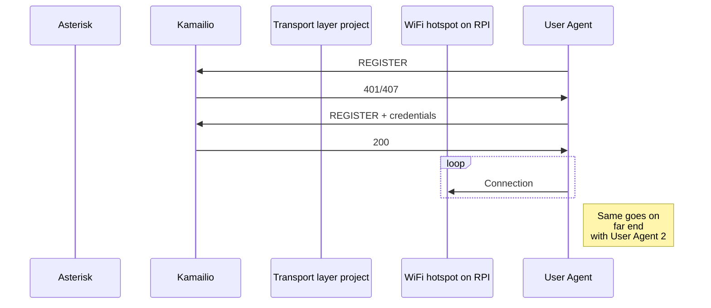
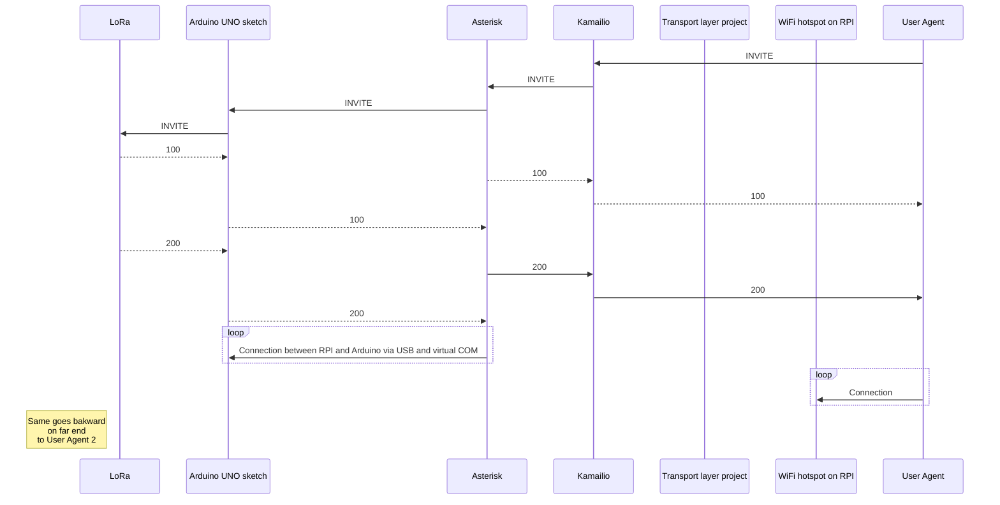

## Project name:

VoLoRa is composite acronym **V**oice **O**ver **LoRa**

## Project description:

Project is in PoC stage. The idea is to send SIP messages
from one device to another over radio channel using LoRa modules.

## Hardware:

* Arduino UNO R3 Compatible Board ATmega328P ATmega16U2
 _(2 pcs)_
* LLCC68 868MHz 915MHz Ebyte LoRa E220-900T30D DIP
 _(2 pcs)_
* 5 dbi Omni Outdoor/Indoor 868MHz 915MHz Antenna N-Male Aerial for LoRa Helium
 _(2 pcs)_
* Raspberry Pi 3/4/400
 _(2 pcs)_

## Software:

* [Kamailio 5.6.2](https://github.com/kamailio/kamailio/tree/5.6.2)
* [Asterisk 20.0.1](https://www.asterisk.org/downloads/)
* Softphone (UA) e.g. [Zoiper](https://www.zoiper.com/)
* _layer project which will allow kamailio to use UDP transport on "fake" port_ - to be created
* _Arduino UNO sketches_

## Schematic:

